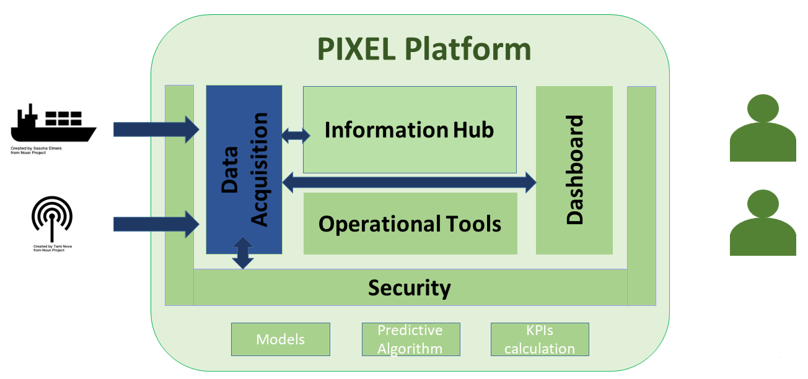
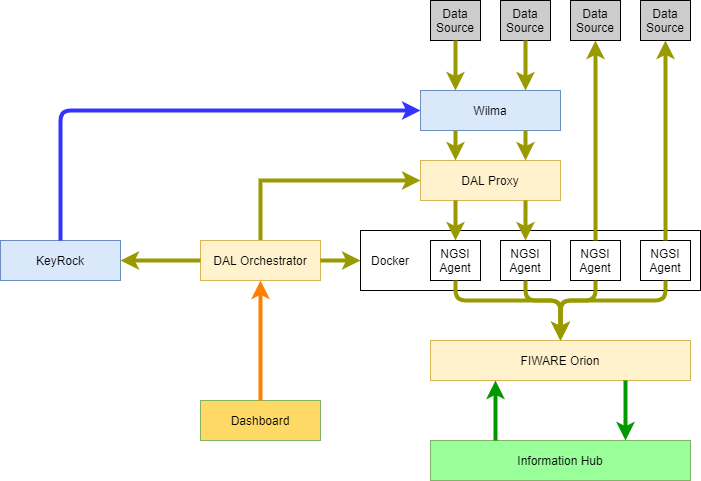
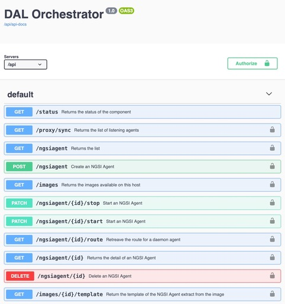
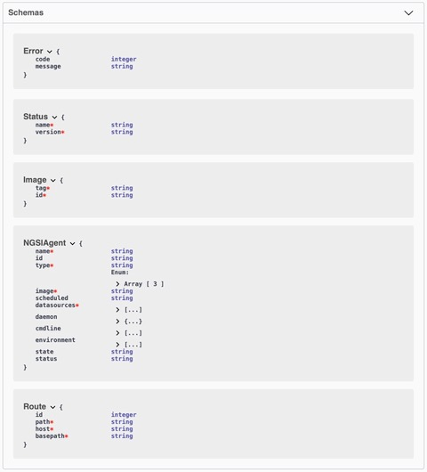

# PIXEL DAL Documentation Page 


---

## Overview
<div align="justify">

This documentation explores in detail the PIXEL Data Acquisition Layer as one of the main components of the PIXEL architecture. To access the main documentation repository of PIXEL, click [here](https://pixel-ports.readthedocs.io/en/latest/). To access the PIXEL project website, click [here](https://pixel-ports.eu/).

> *PIXEL is the first smart, flexible and scalable solution for reducing environmental impacts while enabling the optimization of operations in port ecosystems through IoT.*

PIXEL enables a two-way collaboration of ports, multimodal transport agents and cities for **optimal use of internal and external resources, sustainable economic growth and environmental impact mitigation, towards the Ports of the Future**. Built on top of the state-of-the art interoperability technologies, PIXEL centralises data from the different information silos where internal and external stakeholders store their operational information. PIXEL leverages an **IoT based communication infrastructure** to voluntarily exchange data among ports and stakeholders to achieve an efficient use of resources in ports.

PIXEL has been financed by the **Horizon 2020 initiative** of the European Commission, contract 769355.  
</div>
<br/><br/>


## Main concepts and Architecture
<div align="justify">

The main purpose of the Data Acquisition Layer (DAL)is to interface the external data sources to the **PIXEL Information Hub** and to convert the original and heterogeneous data format to PIXEL Data Models.

<p align="center">

</p>

Data Acquisition exposed API to Dashboard to allow admin to manage the different **NGSI Agents**, and it interacts with **PIXEL Security** to protect the NGSI Agents that exposed API.

<p align="center">

</p>

Main activity of DAL is **NGSI Agents** pushing Data to **Orion**. Then **Information Hub** subscribe to new data using the subscription API of **FIWARE Orion**. It is then notify using a call-back when new data arrive.  
The API of **FIWARE Orion** is well documented by FIWARE. The documentation on the NGSIv2 API is available [here](http://telefonicaid.github.io/fiware-orion/api/v2/stable/), and documentation on how to use it is available [here](https://fiware-orion.readthedocs.io/en/master/user/walkthrough_apiv2/index.html).
To facilitate **NGSI Agents** management, **Data Acquisition** provides an orchestrator that pilot the creation of the NGIS Agents using a Docker Interface. **DAL Orchestrator** also communicates with **DAL Proxy** to automatically exposed new daemon NGSI Agents behind WILMA. **DAL Orchestrator** exposes its API to the Dashboard to allow creation of admin UI.
**DAL Orchestrator** also communicates with **Keyrock** to manage the permissions on WILMA for each **NGSI Agents** that exposed an API through the **DAL Proxy**.

<br/><br/>

</div>

## NGSI Agents
<div align="justify">
NGSI Agents are the small software pieces used to import data from external data sources into the PIXEL platform through the Data Acquisition Layer. There are 3 kinds of NGSI Agents:
  - **Daemon**: running as a server to manage data continuously
  - **Scheduled**: starts automatically at the given period
  - **Manual**: running only when asked (on demand)

In order to run as an NGSI Agent your Docker container needs some special configurations. Those configurations are done using Docker LABEL that could be overwritten when deploying an agent on the destination platform.
In order to be identify the Docker image of an agent it has to contains specifics labels.

Follow the [NGSI Agents CookBook](./ngsiagent_cookbook.md) for more details

## DAL Orchestrator
<div align="justify">
The **DAL Orchestrator** has been developed to simplify the deployment and management of the **NGSI Agents** offering an API to be managed. The server exposes a Swagger and SwaggerUI to simplify the integration for the developer.
```http://<server ip>:<exposed port>/api-docs```

### Paths
The full API is described in a Swagger file. The list of functions is listed below.

<p align="center">

</p>

### Models
The swagger file (UI) also describes the models used with this API

<p align="center">

</p>

### Quick start guide

Follow the [NGSI Agents CookBook](./ngsiagent_cookbook.md) To see how to deploy an agent

You can request the list of available NGSI Agents images already available on the host with an API call:


```
curl  -H "X-Auth-Token: default"  http://172.17.0.1:8888/api/images
[
    {
        "id": "sha256:620877b976447800bc7ce8672d6b688369b429ad77afba0968f20088c8daf8fd",
        "tag": "pixelh2020/frbodtidesensor:1.0.0"
    }        
]
```
<br/>

  - Get a template
<br/>
When you have chosen the image of your NGSI Agents, you can generate a template to create it


```
curl  -H "X-Auth-Token: default"  http://172.17.0.1:8888/api/images/sha256:620877b976447800bc7ce8672d6b688369b429ad77afba0968f20088c8daf8fd/template 
{
    "name": "/?[a-zA-Z0-9_-]+",
    "image": "pixelh2020/frbodtidesensor:1.0.0",
    "type": "scheduled",
    "scheduled": "22 * * * *",
    "datasources": [
        "urn:pixel:DataSource:frbod:TideSensorObserved"
    ],
    "datamodels": [
        "/Pixel/TideSensorObserved/schema.json"
    ],
    "environment": [
        {
            "key": "PATH",
            "value": "/usr/local/sbin:/usr/local/bin:/usr/sbin:/usr/bin:/sbin:/bin"
        },
        {
            "key": "NODE_VERSION",
            "value": "13.6.0"
        },
        {
            "key": "YARN_VERSION",
            "value": "1.21.1"
        },
        {
            "key": "NODE_TLS_REJECT_UNAUTHORIZED",
            "value": "0"
        },
        {
            "key": "ORION_URL",
            "value": "changeit"
        },
        {
            "key": "NAMI_AUTH_URL",
            "value": "https://nami.bordeaux-port.fr/?q=accueil"
        },
        {
            "key": "NAMI_URL",
            "value": "https://nami.bordeaux-port.fr/hauteurs"
        },
        {
            "key": "NAMI_LOGIN",
            "value": "changeit"
        },
        {
            "key": "NAMI_PASSWORD",
            "value": "changeit"
        },
        {
            "key": "FIWARE_SERVICE="
        },
        {
            "key": "FIWARE_SERVICE_PATH="
        }
    ]
}
```
<br/>
  - Create the NGSI Agent
<br/>

Change the name of the agent (it will be the name of the container) and adjust the parameters or let their default values. Be sure that your name match the given pattern.


```
curl  -X POST -H "X-Auth-Token: default"  http://172.17.0.1:8888/api/ngsiagent -d @- <<EOF
{
    "name": "/my-agent",
    "image": "pixelh2020/frbodtidesensor:1.0.0",
    "type": "scheduled",
    "scheduled": "22 * * * *",
    "datasources": [
        "urn:pixel:DataSource:frbod:TideSensorObserved"
    ],
    "datamodels": [
        "/Pixel/TideSensorObserved/schema.json"
    ],
    "environment": [
        {
            "key": "ORION_URL",
            "value": "http://172.17.0.1:1026"
        },
        {
            "key": "NAMI_LOGIN",
            "value": "mylogin"
        },
        {
            "key": "NAMI_PASSWORD",
            "value": "mypassword"
        }
    ]
}
EOF
```
</div>
