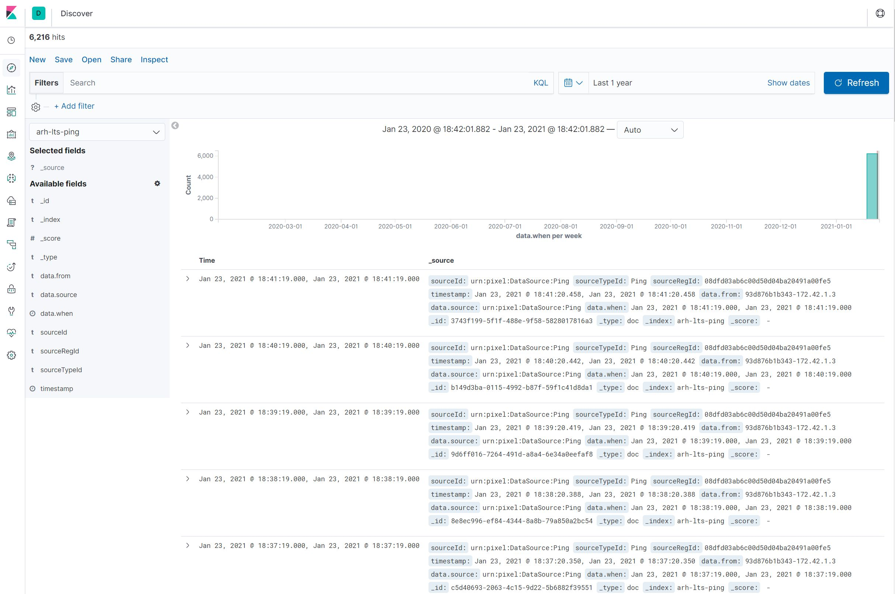

# NGSI Agent CookBook

You can access the [PIXEL End 2 End tests](./pixel-e2e.md) with simple agents and tests.

*Note: The previous tests are based on 'ping' NGSI Agents in mode 'update' and cover the path Orion-IH. In the following, we will also use another 'ping' NGSI Agent in mode 'insert'. This is also associated with a 'pingcount' model able to read data from IH and write results in Elastic, covering a whole end-to-end scenario*

## Requirements
<div align="justify">

In order to be deployed on a PIXEL Platform using the DAL and to be automatically detected by the Information Hub, NGSI Agents have to fulfill several requirements

* DataModels should be registered
* URN to identify the Data Source should be defined
* Source ID provide with each entity pushed in ORION
* DataSource have to be declared in Orion 
* The agent should be dockerized with the needed labels
* The agent should be deployed with the Orchestrator

*Note: We will include here a basic Ping NGSI agent as practical case. Code available at: [https://gitpixel.satrdlab.upv.es/benmomo/ngsi-agents-thpa/src/master/thpa-ping](https://gitpixel.satrdlab.upv.es/benmomo/ngsi-agents-thpa/src/master/thpa-ping)*

### Data Models

The Data Models used by the NGSI Agents have to be added to the [PIXEL DataModel repository](https://gitpixel.satrdlab.upv.es/iglaub/Data_Models.git). The specific ones for PIXEL should be placed under the *specs/Pixel* folder.

The path of the json schema relative to spec folder will be needed, for exemple ```/Dummies/minimal-schema.json```

For the Ping example we have the schema at [https://gitpixel.satrdlab.upv.es/iglaub/Data_Models/src/master/specs/Pixel/Ping](https://gitpixel.satrdlab.upv.es/iglaub/Data_Models/src/master/specs/Pixel/Ping). Remember to validate the schema.json (check for JSON syntax errors) before deploying the agent, otherwise any syntax error will cause the DAL orchestrator to claim for (you will only see that by doing **docker logs dal_orchestrator**)

The data models repository must be updated on the platform:
* on PUBLIC host : git pull on /opt/pixel/Data_Models

          root@vm-pixel-public:/opt/pixel/Data_Models# GIT_SSL_NO_VERIFY=false git pull 
* on CORE host : /opt/pixel/Installation/docker/core/update-datarepo.sh

          root@vm-pixel-core:/opt/pixel/Installation# GIT_SSL_NO_VERIFY=false git pull 
          root@vm-pixel-core:/opt/pixel/Installation/docker/core# ./update-datarepo.sh 
          
   Note: Sometimes the *update-datarepo.sh* does not correctly update the repo. To check this, just connect to the datarepo container on the CORE host:
   
           root@vm-pixel-core:/opt/pixel/Installation# docker exec -it datarepo /bin/bash
           root@datarepo# ls /opt/pixel/datamodels/specs/Pixel
   
   If your new Datamodel is not there, then do the following in CORE host and recheck again:
         
          root@vm-pixel-core:/opt/pixel/Installation# docker stop datarepo
          root@vm-pixel-core:/opt/pixel/Installation# docker rm datarepo
          root@vm-pixel-core:/opt/pixel/Installation# docker rmi datarepo
          root@vm-pixel-core:/opt/pixel/Installation# ./install.sh
          
          

### Data Source URN

Each Data Source is identified with an URN following this syntax ```urn:pixel:DataSource:<LOCODE>:<SourceName>```

For example : ```urn:pixel:DataSource:frbod:TideSensorObserved```

### Provide Source ID in Entity

This source ID have to be provided in each entity pushed to Orion using the ```source``` field. IH use this field to decide what to do with the entity.

### Declare DataSource in Orion

In order to be automatically imported by Information Hub you need to create 3 objects in Orion ```DataModel```, ```SourceModelRelation``` and ```DataSource``` (always finish by DataSource)

Those objects are describe in the [Developer guide](./devel_guide.md)

If you plan to deploy the agent using the DAL Orchestrator, let it manage this part.

You also can create those objects manually, or using the ```POST register``` api of the DAL Orchestrator

### Dockerize NGSI Agents

In order to be identified and imported by the DAL Orchestrator the NGSI Agent have to fulfill several requirements using DOCKER LABEL :

#### Labels for all agents
  - **ngsiagent.mode="insert"**: 'update' is the default mode, and will provoke that the IH subscriber makes an update in Elastic. With 'insert', the IH subscriber makes an insert in Elasticsearch. The latter is the typical mode where an NGSI agent uses the same 'id' for every executions (no datetime timestamp), and the historic is then stored in Elastic
  - **ngsiagent="pixel"**: this is the key label to be identified as a NGSI Agent
  - **ngsiagent.type="daemon"**: define the type of NGSI Agent daemon, scheduled or manual
  - **ngsiagent.datasources="[\"urn:pixel:DataSource:dummies\"]"**: this label provides the name of the datasource managed by this agent
  - **ngsiagent.datamodels="[\"/Dummies/minimal-schema.json\"]"**: this label provide the path to each JSON Schema generated by the agent
The DataModels Path is the relative path to the specs folder of the Data_Models repository.
For example for the data model TideSensorObserved the label should be set like this: ngsiagent.datamodels="[\"/Pixel/TideSensorObserved/schema.json\"]"

#### Labels for daemon agents
  - **ngsiagent.internal.port:** the port exposing the API, it also has to be specified with ÈXPOSE
  - **ngsiagent.internal.path:** the base path of the API configured in the agent
  - **ngsiagent.external.path:*** the base path of the API configured in the proxy to expose the agent

#### Labels for scheduled agents
  - **ngsiagent.scheduled**: the frequency to run the agent (CRON format). *Note*: the last level (year) is not handled by the DAL
```
* * * * * *
| | | | | | 
| | | | | +-- Year              (range: 1900-3000)
| | | | +---- Day of the Week   (range: 1-7, 1 standing for Monday)
| | | +------ Month of the Year (range: 1-12)
| | +-------- Day of the Month  (range: 1-31)
| +---------- Hour              (range: 0-23)
+------------ Minute            (range: 0-59)
```
#### Examples
##### Daemon
```
FROM nginx
LABEL ngsiagent="pixel"
LABEL ngsiagent.type="daemon"
LABEL ngsiagent.internal.port="80"
LABEL ngsiagent.internal.path="/api"
LABEL ngsiagent.external.path="/empire"
LABEL ngsiagent.datasources="[\"urn:pixel:DataSource:dummies\"]"
LABEL ngsiagent.datamodels="[\"/Dummies/minimal-schema.json\"]"
EXPOSE 80
ENV PIXEL=test
ENV MYTEST=pixel
RUN mkdir /usr/share/nginx/html/api
RUN echo "Execute order 66" > /usr/share/nginx/html/api/order
ENTRYPOINT ["nginx"]CMD ["-g", "daemon off;"]
```

##### Scheduled
```
FROM ubuntu
LABEL ngsiagent="pixel"
LABEL ngsiagent.type="scheduled"
LABEL ngsiagent.scheduled="* * * * *"
LABEL ngsiagent.datasources="[\"urn:pixel:DataSource:dummies\"]"
LABEL ngsiagent.datamodels="[\"/Dummies/minimal-schema.json\"]"
ENV PIXEL=test
ENV MYTEST=pixel
ENV SCHEDULED_DELAY=0
COPY docker_entrypoint.sh /docker_entrypoint.sh
RUN chmod u+rx /docker_entrypoint.sh
ENTRYPOINT ["/docker_entrypoint.sh"]
```

##### Manual
```
FROM ubuntu
LABEL ngsiagent="pixel"
LABEL ngsiagent.type="manual"
LABEL ngsiagent.datasources="[\"urn:pixel:DataSource:dummies\"]"
LABEL ngsiagent.datamodels="[\"/Dummies/minimal-schema.json\"]"
ENTRYPOINT ["/bin/bash"]CMD ["date"]
```
## Create the Agent using DAL Orchestrator

The API from the Orchestrator is protected with an ```API-KEY```. Its value could be find in the ```secrets``` folder of the PUBLIC host.

          root@vm-pixel-public:/opt/pixel/Installation/docker/public/secrets# nano dal.orchestrator.api.token

The API is not exposed outside the platform, you have to request it directly from the PUBLIC host, or create an SSH tunnel to access its swagger:

```ssh -i <keyfile> -L 127.0.0.1:8088:127.0.0.1:8080 root@xxx.xxx.xxx.xxx```

Then you can access the [swagger](http://127.0.0.1:8080/api-docs)

In order to be used with the orchestrator, the docker image should be available in the local docker repository (docker pull <imagename>).
For example, for a test ping NGSI agent:

          root@vm-pixel-public:/opt/pixel/Installation# docker pull pixelh2020/pingtest:0.1

You can request the list of available NGSI Agents images already available on the host with an API call (**/images in Swagger**):


```
curl  -H "X-Auth-Token: default"  http://172.17.0.1:8888/api/images
[
    {
        "id": "sha256:620877b976447800bc7ce8672d6b688369b429ad77afba0968f20088c8daf8fd",
        "tag": "pixelh2020/frbodtidesensor:1.0.0"
    }        
]
```
For the ping NGSI agent you could get something like this as response:

````
[
  {
    "id": "sha256:476573a6b213a4e16152dd9cd0ca8a62dbf06c8452e13c17f8bcf9e8e922becc",
    "tag": "pixelh2020/pingtest:0.1"
  }
]
````


<br/>

  - Get a template
<br/>

When you have chosen the image of your NGSI Agents, you can generate a template to create it (**/images/{id}/template in Swagger**)


```
curl  -H "X-Auth-Token: default"  http://172.17.0.1:8888/api/images/sha256:620877b976447800bc7ce8672d6b688369b429ad77afba0968f20088c8daf8fd/template 
{
    "name": "/?[a-zA-Z0-9_-]+",
    "image": "pixelh2020/frbodtidesensor:1.0.0",
    "type": "scheduled",
    "scheduled": "22 * * * *",
    "datasources": [
        "urn:pixel:DataSource:frbod:TideSensorObserved"
    ],
    "datamodels": [
        "/Pixel/TideSensorObserved/schema.json"
    ],
    "environment": [
        {
            "key": "PATH",
            "value": "/usr/local/sbin:/usr/local/bin:/usr/sbin:/usr/bin:/sbin:/bin"
        },
        {
            "key": "NODE_VERSION",
            "value": "13.6.0"
        },
        {
            "key": "YARN_VERSION",
            "value": "1.21.1"
        },
        {
            "key": "NODE_TLS_REJECT_UNAUTHORIZED",
            "value": "0"
        },
        {
            "key": "ORION_URL",
            "value": "changeit"
        },
        {
            "key": "NAMI_AUTH_URL",
            "value": "https://nami.bordeaux-port.fr/?q=accueil"
        },
        {
            "key": "NAMI_URL",
            "value": "https://nami.bordeaux-port.fr/hauteurs"
        },
        {
            "key": "NAMI_LOGIN",
            "value": "changeit"
        },
        {
            "key": "NAMI_PASSWORD",
            "value": "changeit"
        },
        {
            "key": "FIWARE_SERVICE="
        },
        {
            "key": "FIWARE_SERVICE_PATH="
        }
    ]
}
```
For the ping example, you may get something like this as repsonse:

```
{
  "name": "/?[a-zA-Z0-9_-]+",
  "image": "pixelh2020/pingtest:0.1",
  "type": "scheduled",
  "scheduled": "* * * * *",
  "datasources": [
    "urn:pixel:DataSource:Ping"
  ],
  "datamodels": [
    "/Pixel/Ping/schema.json"
  ],
  "mode": "insert",
  "environment": [
    {
      "key": "PATH",
      "value": "/usr/local/bin:/usr/local/sbin:/usr/local/bin:/usr/sbin:/usr/bin:/sbin:/bin"
    },
    {
      "key": "LANG",
      "value": "C.UTF-8"
    },
    {
      "key": "GPG_KEY",
      "value": "E3FF2839C048B25C084DEBE9B26995E310250568"
    },
    {
      "key": "PYTHON_VERSION",
      "value": "3.8.6"
    },
    {
      "key": "PYTHON_PIP_VERSION",
      "value": "20.2.3"
    },
    {
      "key": "PYTHON_GET_PIP_URL",
      "value": "https://github.com/pypa/get-pip/raw/fa7dc83944936bf09a0e4cb5d5ec852c0d256599/get-pip.py"
    },
    {
      "key": "PYTHON_GET_PIP_SHA256",
      "value": "6e0bb0a2c2533361d7f297ed547237caf1b7507f197835974c0dd7eba998c53c"
    },
    {
      "key": "LC_ALL",
      "value": "C.UTF-8"
    }
  ]
}
```

<br/>
  - Create the NGSI Agent (**POST /ngsiagent in Swagger**)
<br/>

Change the name of the agent (it will be the name of the container) and adjust the parameters or let their default values. Be sure that your name matches the given pattern.


```
curl  -X POST -H "X-Auth-Token: default"  http://172.17.0.1:8888/api/ngsiagent -d @- <<EOF
{
    "name": "/my-agent",
    "image": "pixelh2020/frbodtidesensor:1.0.0",
    "type": "scheduled",
    "scheduled": "22 * * * *",
    "datasources": [
        "urn:pixel:DataSource:frbod:TideSensorObserved"
    ],
    "datamodels": [
        "/Pixel/TideSensorObserved/schema.json"
    ],
    "environment": [
        {
            "key": "ORION_URL",
            "value": "http://172.17.0.1:1026"
        },
        {
            "key": "NAMI_LOGIN",
            "value": "mylogin"
        },
        {
            "key": "NAMI_PASSWORD",
            "value": "mypassword"
        }
    ]
}
EOF
```
For the ping example, we just take the previous response from the template and change the name to '/ping-test', and include the ENV variables: ORION_HOST (private IP of CORE VM). ORION_PORT is not needed (1026 as default), as well as ORION_SERVICE and ORION_SERVICEPATH. These last two were initally considered to be **PIXEL** and **/GRSKG** respectively, but should **not** be included here (nor considered in the NGSI implementation code)

```
{
  "name": "/pingtest",
  "image": "pixelh2020/pingtest:0.1",
  "type": "scheduled",
  "scheduled": "* * * * *",
  "datasources": [
    "urn:pixel:DataSource:Ping"
  ],
  "datamodels": [
    "/Pixel/Ping/schema.json"
  ],
  "mode": "insert",
  "environment": [
    {
      "key": "PATH",
      "value": "/usr/local/bin:/usr/local/sbin:/usr/local/bin:/usr/sbin:/usr/bin:/sbin:/bin"
    },
    {
      "key": "LANG",
      "value": "C.UTF-8"
    },
    {
      "key": "GPG_KEY",
      "value": "E3FF2839C048B25C084DEBE9B26995E310250568"
    },
    {
      "key": "PYTHON_VERSION",
      "value": "3.8.6"
    },
    {
      "key": "PYTHON_PIP_VERSION",
      "value": "20.2.3"
    },
    {
      "key": "PYTHON_GET_PIP_URL",
      "value": "https://github.com/pypa/get-pip/raw/fa7dc83944936bf09a0e4cb5d5ec852c0d256599/get-pip.py"
    },
    {
      "key": "PYTHON_GET_PIP_SHA256",
      "value": "6e0bb0a2c2533361d7f297ed547237caf1b7507f197835974c0dd7eba998c53c"
    },
    {
      "key": "LC_ALL",
      "value": "C.UTF-8"
    },
    {
      "key": "ORION_HOST",
      "value": "10.90.1.53"
    }
  ]
}
```

The result, if everything goes fine, is:
```
{
  "id": "93d876b1b34303754fc67030effcfa54bae046a3af39b69b30a7cd486ca73d42"
}
```

Now you can make a GET request to the **/ngsiagent** and get the available agents. For the ping test the response will be something like:
```
[
  {
    "id": "93d876b1b34303754fc67030effcfa54bae046a3af39b69b30a7cd486ca73d42",
    "name": "/pingtest",
    "type": "scheduled",
    "state": "exited",
    "status": "Exited (0) 30 seconds ago"
  }
]
```
If you want to check if the information is arriving in Orion, you can just use from the console in the PUBLIC VM a **curl** command:

```
curl http://10.90.1.53:1026/v2/entities -s -S -H 'Accept: application/json' 
```
For the ping example, the response will be something like

```
[{"id":"Ping","type":"DataModel","schemaUrl":{"type":"string","value":"http://schemas.pixel.internal/Pixel/Ping/schema.json","metadata":{}}},{"id":"urn:pixel:SourceModel:Ping:Ping","type":"SourceModelRelation","model":{"type":"Text","value":"Ping","metadata":{}},"source":{"type":"Text","value":"urn:pixel:DataSource:Ping","metadata":{}}},{"id":"PingTest","type":"Ping","from":{"type":"Text","value":"93d876b1b343-172.42.1.3","metadata":{}},"source":{"type":"Text","value":"urn:pixel:DataSource:Ping","metadata":{}},"when":{"type":"Text","value":"2021-01-23T19:28:18+02:00","metadata":{}}},{"id":"urn:pixel:DataSource:Ping","type":"DataSource","name":{"type":"Text","value":"urn:pixel:DataSource:Ping","metadata":{}},"same-id-mode":{"type":"Text","value":"insert","metadata":{}}}]
```
If you prefer a better visual output you might install jq (**sudo apt-get install jq**) and then make the same query with this tool

```
curl http://10.90.1.53:1026/v2/entities -s -S -H 'Accept: application/json' | jq
```
So you will get something like

```
[
  {
    "id": "Ping",
    "type": "DataModel",
    "schemaUrl": {
      "type": "string",
      "value": "http://schemas.pixel.internal/Pixel/Ping/schema.json",
      "metadata": {}
    }
  },
  {
    "id": "urn:pixel:SourceModel:Ping:Ping",
    "type": "SourceModelRelation",
    "model": {
      "type": "Text",
      "value": "Ping",
      "metadata": {}
    },
    "source": {
      "type": "Text",
      "value": "urn:pixel:DataSource:Ping",
      "metadata": {}
    }
  },
  {
    "id": "PingTest",
    "type": "Ping",
    "from": {
      "type": "Text",
      "value": "93d876b1b343-172.42.1.3",
      "metadata": {}
    },
    "source": {
      "type": "Text",
      "value": "urn:pixel:DataSource:Ping",
      "metadata": {}
    },
    "when": {
      "type": "Text",
      "value": "2021-01-23T19:28:18+02:00",
      "metadata": {}
    }
  },
  {
    "id": "urn:pixel:DataSource:Ping",
    "type": "DataSource",
    "name": {
      "type": "Text",
      "value": "urn:pixel:DataSource:Ping",
      "metadata": {}
    },
    "same-id-mode": {
      "type": "Text",
      "value": "insert",
      "metadata": {}
    }
  }
]
```
*Note*: It is important that the 'id' of the data entity (PingTest) is different than the 'id' of the DataModel entity (Ping). Otherwise, we might have two entities with the same id (possible for Orion unless the 'type' field is different), but might cause inconsistencies in some IH components. 

You might execute the command every minute and check that the *when* field is being updated.

Now you can check if this information is also getting to the IH. You can first check the subscriptions to Orion:

```
curl http://10.90.1.53:1026/v2/subscriptions -s -S -H 'Accept: application/json' | jq
```
For the ping example, the response will be something like

```
[
  {
    "id": "6006a31653cbffafa7cd7304",
    "description": "Information Hub subscription to DataSource notifications.",
    "status": "active",
    "subject": {
      "entities": [
        {
          "idPattern": ".*",
          "type": "DataSource"
        }
      ],
      "condition": {
        "attrs": []
      }
    },
    "notification": {
      "timesSent": 4,
      "lastNotification": "2021-01-23T17:26:38.00Z",
      "attrs": [],
      "onlyChangedAttrs": false,
      "attrsFormat": "normalized",
      "http": {
        "url": "http://172.28.1.15:9009/DataSource"
      },
      "lastSuccess": "2021-01-23T17:26:38.00Z",
      "lastSuccessCode": 200
    }
  },
  {
    "id": "6006ac5a53cbffafa7cd7305",
    "description": "Information Hub subscription to the source urn:pixel:DataSource:Ping.",
    "status": "active",
    "subject": {
      "entities": [
        {
          "idPattern": ".*"
        }
      ],
      "condition": {
        "attrs": [],
        "expression": {
          "q": "source==urn:pixel:DataSource:Ping"
        }
      }
    },
    "notification": {
      "timesSent": 6205,
      "lastNotification": "2021-01-23T17:34:20.00Z",
      "attrs": [],
      "onlyChangedAttrs": false,
      "attrsFormat": "normalized",
      "http": {
        "url": "http://172.28.1.15:9009/urn%3Apixel%3ADataSource%3APing"
      },
      "lastSuccess": "2021-01-23T17:34:20.00Z",
      "lastSuccessCode": 200
    }
  }
]
```
Now you can query the IH API for the sources (from the CORE-VM)

```
curl http://172.25.1.17:8080/archivingSystem/extractor/v1/sources 
```
and you should get something like this (Ping example):

```
[
  {
    "sourceId": "urn:pixel:DataSource:Ping",
    "sourceTypeId": "Ping",
    "indexName": "arh-lts-ping"
  }
]
```
We can also check the data in Kibana. The URL depends on your site. For THPA it is [(https://admin.grskg.pixel-ports.eu/kibana/app/kibana](https://admin.grskg.pixel-ports.eu/kibana/app/kibana)
user: pixel
pass= look in public VM /opt/pixel/Installation/docker/public/secrets/frontrp.admin.password
So in Kibana you have now a new index called **arh-lts-ping** and you should be able to discover the data there. In our ping example, you should get something like this:

<p align="center">
     
</p>

</div>
